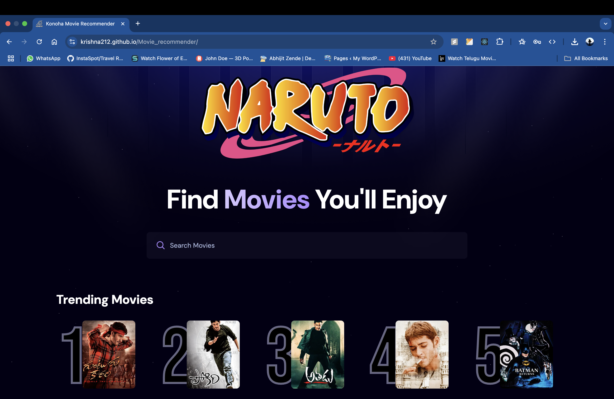

# 🎬 Movie Recommender

A sleek, responsive movie recommendation web app built using **React** and powered by **The Movie Database (TMDb)** API. It allows users to search for movies and discover trending titles.



---

## 🚀 Features

- 🔍 **Search Movies** by title with live results
- 📈 **Trending Section** showcasing currently popular movies
- ⚛️ Built with **React + Vite** for fast performance
- 🎨 Styled with **Tailwind CSS**
- ⏳ Debounced search for optimized performance
- 
---

## 🛠 Tech Stack

- React
- Vite
- Tailwind CSS
- TMDb API

---

## 📦 Setup Instructions

### 1. Clone the Repository

```bash
git clone https://github.com/krishna212/Movie_recommender.git
cd Movie_recommender
```
### 2. Install Dependencies

```bash
npm install
```
### 3. Start Development Server

```bash
npm run dev
```
